# Unity Lightmap Scaler Tool

[English](README.md) | [日本語](README_JP.md)

An Editor Extension tool for efficiently bulk-setting and auto-correcting the `Scale In Lightmap` values for multiple objects in the Unity Editor. It is especially powerful when building large-scale background scenes using lightmappers like Bakery.

> **⚠️ Note: The Auto UV Scale Correction feature requires Bakery's `BakeryLightmapGroupSelector` component to be attached to the target objects (or their parent hierarchy).**

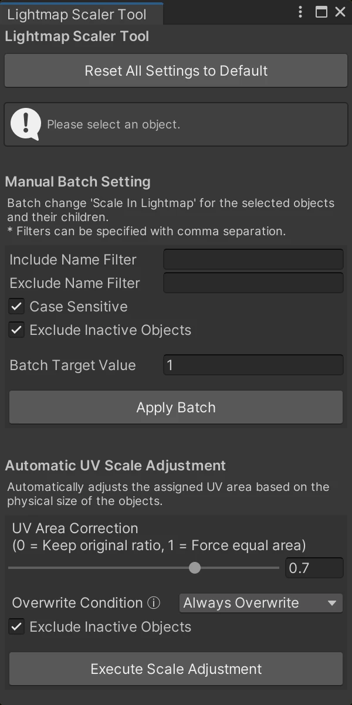

## What's New (v1.1.0)

- **v1.1.0**: Renamed "Overwrite Only If Needed" to **"Smart Overwrite"**. Fixed a bug in overwrite condition logic for cases where the calculated target scale is `1.0`.
- **v1.0.0**: Initial release! Implemented Manual Batch Setting and surface-area-based Auto UV Scale Correction.

## Overview

Manually adjusting the lightmap resolution (density) for each object when baking lightmaps for large background scenes is extremely tedious. This tool streamlines this process using two approaches:

1. **Manual Batch Setting**: Bulk-change the `Scale In Lightmap` for groups of objects with specific names using a filter feature.
2. **Auto UV Scale Correction**: Calculates the actual "surface area" of the 3D meshes and automatically assigns values so that objects of different sizes have a uniform lightmap density. (_Note: This feature requires Bakery's `BakeryLightmapGroupSelector` component to be attached to the target objects or their parent hierarchy._)

---

## Installation

1. Download the latest release ZIP file (e.g., `LightmapScalerTool_EN_v1.1.0.zip`) from the GitHub Releases page and extract it.
2. Place the extracted `LightmapScalerTool_EN.cs` inside a folder named **`Editor`** anywhere within your Unity project's `Assets` folder. (Example: `Assets/Editor/Tools/`)
3. Once compiled, **`Tools > Lightmap Scaler Tool`** will be added to the top menu in Unity, and it will be ready to use.

- Note: If you prefer the Japanese version, please download `LightmapScalerTool_JP_v1.1.0.zip`. The features are completely identical.

---

## Usage

When you open the tool window, there are two main feature sections.

### 1. Manual Batch Setting (For adjusting specific parts together)

Applies a specific scale value in bulk to all `MeshRenderer`s on the selected object(s) and their child hierarchies.

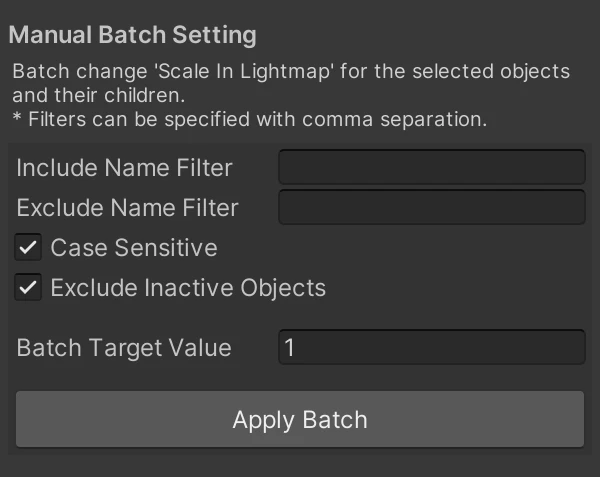

- **Include Name Filter** _(comma-separated, multiple values supported)_  
  Only objects whose name contains the specified string(s) will be targeted. (e.g. `Wall,Floor`)

- **Exclude Name Filter** _(comma-separated, multiple values supported)_  
  Objects whose name contains the specified string(s) will be excluded from the target.

- **Case Sensitive**  
  When enabled, filter matching becomes strict. (e.g. `wall` ≠ `Wall`)

- **Exclude Inactive Objects**  
  When enabled, disabled objects and their children are excluded from processing.

- **Batch Scale Value**  
  The `Scale In Lightmap` value to apply to the target `MeshRenderer`s.

- **Instructions**:
  1. Select the target parent object(s) in the Hierarchy (multiple selection supported).
  2. Enter the "Include Name Filter" or "Exclude Name Filter" if necessary (multiple terms can be comma-separated, e.g., `Wall,Floor`).
  3. Enter the "Batch Scale Value" and click the "Apply Batch Setting" button.

> 📝 Filters use **partial matching**. (e.g. `Wall` will also match `Wall_01` and `MyWall`)

### 2. Auto UV Scale Correction (For naturally adjusting based on object surface area)

> **⚠️ Requirement**: This feature relies on the Bakery asset. All objects to be compared must have the `BakeryLightmapGroupSelector` component attached (either directly or on a parent object) and be assigned to the same Lightmap Group.

Compares the "3D surface area" among objects belonging to the same lightmap group and automatically assigns the optimal `Scale In Lightmap` value.

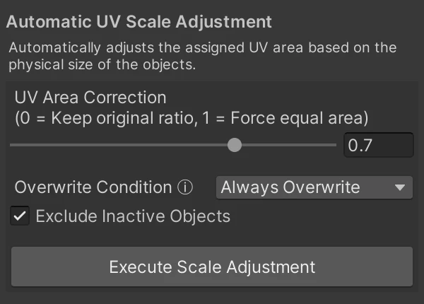

- **UV Area Correction (Gamma Value) (0.01 - 1.0)**:  
  Adjusts the strength of the correction. Values closer to 1.0 equalize the area differences more strongly (at 1.0, all objects receive the same area). Values closer to 0 maintain the original ratios.

<table width="100%">
  <tr>
    <th width="33%" align="center">No Correction</th>
    <th width="33%" align="center">0.5</th>
    <th width="33%" align="center">0.7</th>
  </tr>
  <tr>
    <td align="center">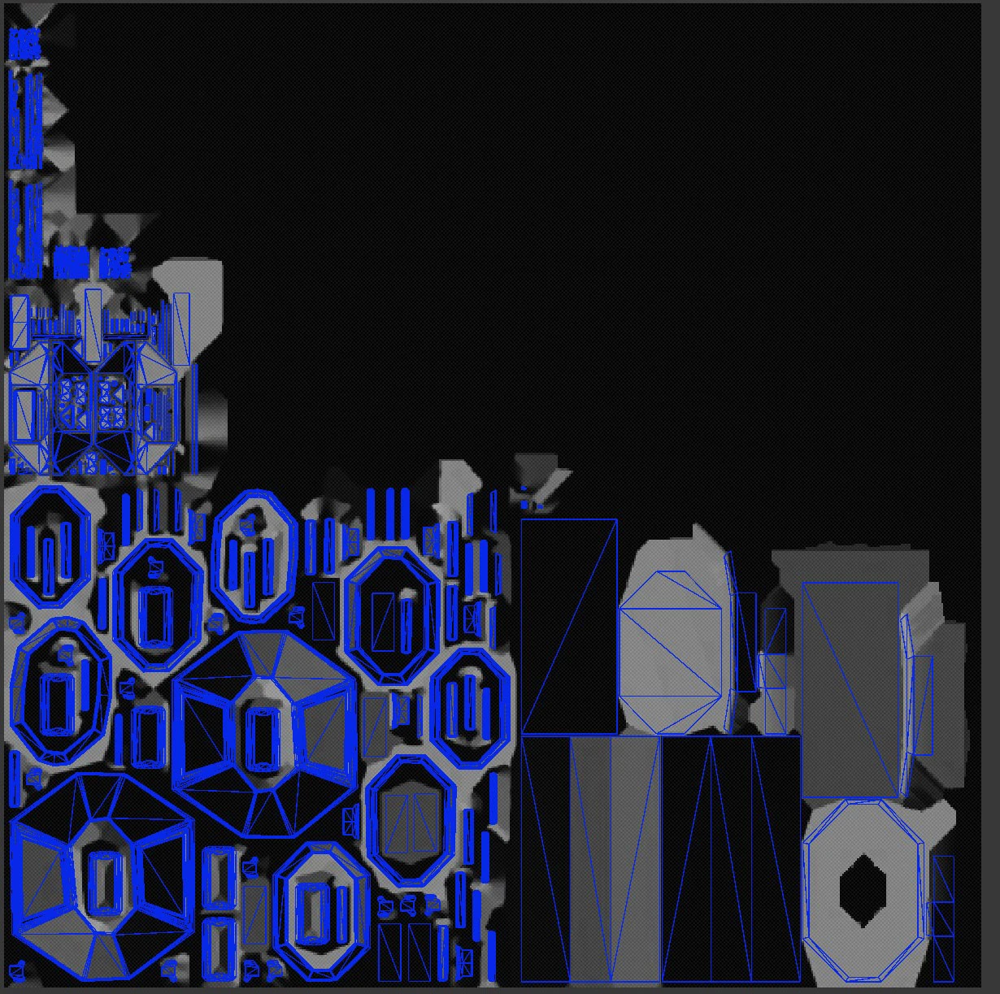</td>
    <td align="center">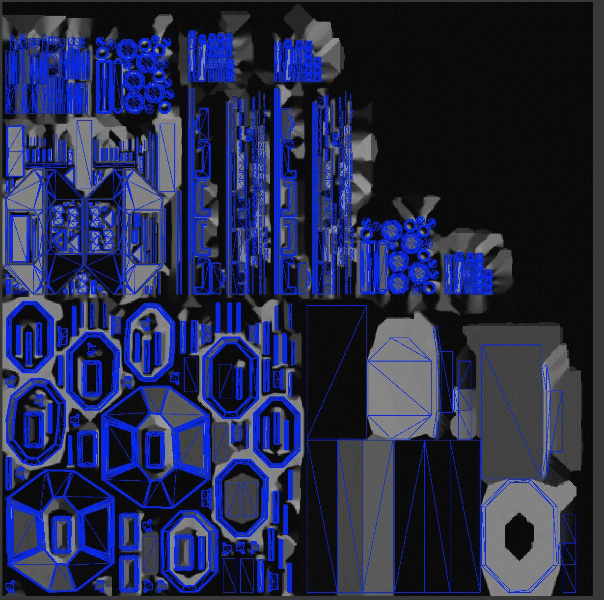</td>
    <td align="center">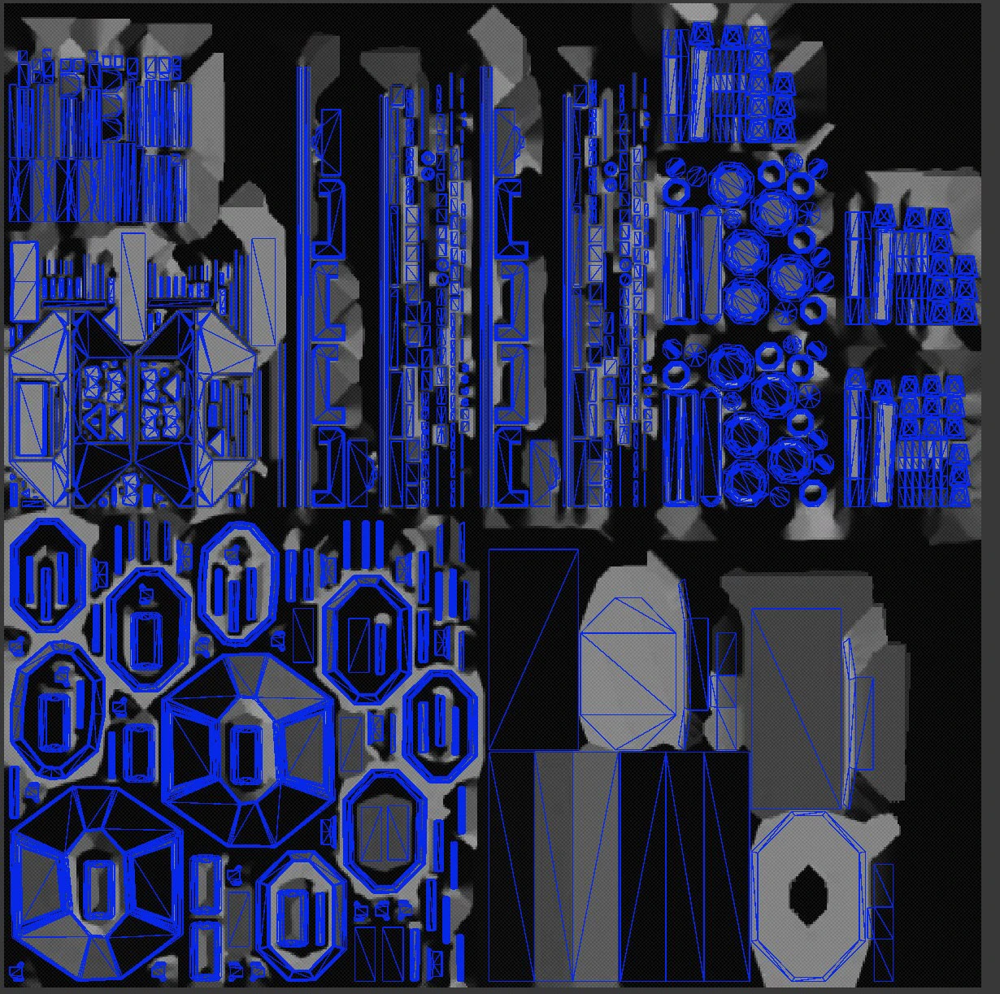</td>
  </tr>
</table>

- **Overwrite Mode** _(4 options)_:  
  Controls which objects the calculated correction value is applied to.

  | Mode                            | Behavior                                                                                                                                                                                             |
  | ------------------------------- | ---------------------------------------------------------------------------------------------------------------------------------------------------------------------------------------------------- |
  | **Always Overwrite**            | Ignores the current value and overwrites all targets with the calculated value                                                                                                                       |
  | **Overwrite Only If Too Small** | Overwrites only targets where the current value is smaller than the calculated value, expanding them                                                                                                 |
  | **Overwrite Only If Too Large** | Overwrites only targets where the current value is larger than the calculated value, shrinking them                                                                                                  |
  | **Smart Overwrite**             | Corrects scale in both directions (expand and shrink). However, any object already set beyond the target value (above or below) is treated as an intentional manual adjustment and will be preserved |

- **Exclude Inactive Objects**:  
  When enabled, objects that are disabled in the scene will be excluded from correction.

- **Instructions**:
  1. Select **exactly one** `MeshRenderer` that belongs to the Lightmap Group you want to correct.
  2. Set the "UV Area Correction (Gamma Value)" and "Overwrite Mode".
  3. Click the "Execute Scale Correction" button.

> 📝 The correction results (number corrected / excluded) are displayed in the status message at the top of the tool window.

---

## Technical Details (Tips)

This auto-correction isn't just a simple scale alignment; it uses gamma correction based on the "median area".

1. Calculates the surface area of all meshes in the target group, using their **median** as the base area.
2. Divides each object's area by the base area to find the "relative area ratio".
3. Calculates the final target scale using the specified **UV Area Correction (Gamma Value)**:
   `targetScale = pow(1 / relativeRatio, gammaValue)`

- Here is an example of testing objects with the exact same shape but different scales. The left shows the setup before baking (testing environment), and the right shows the result after baking (lightmap applied). Below that, you can see how the allocated lightmap area changes when the gamma value is adjusted in this environment.

<table width="40%">
  <tr>
    <th align="center">Before Bake (Setup)</th>
    <th align="center">After Bake (Result)</th>
  </tr>
  <tr>
    <td align="center">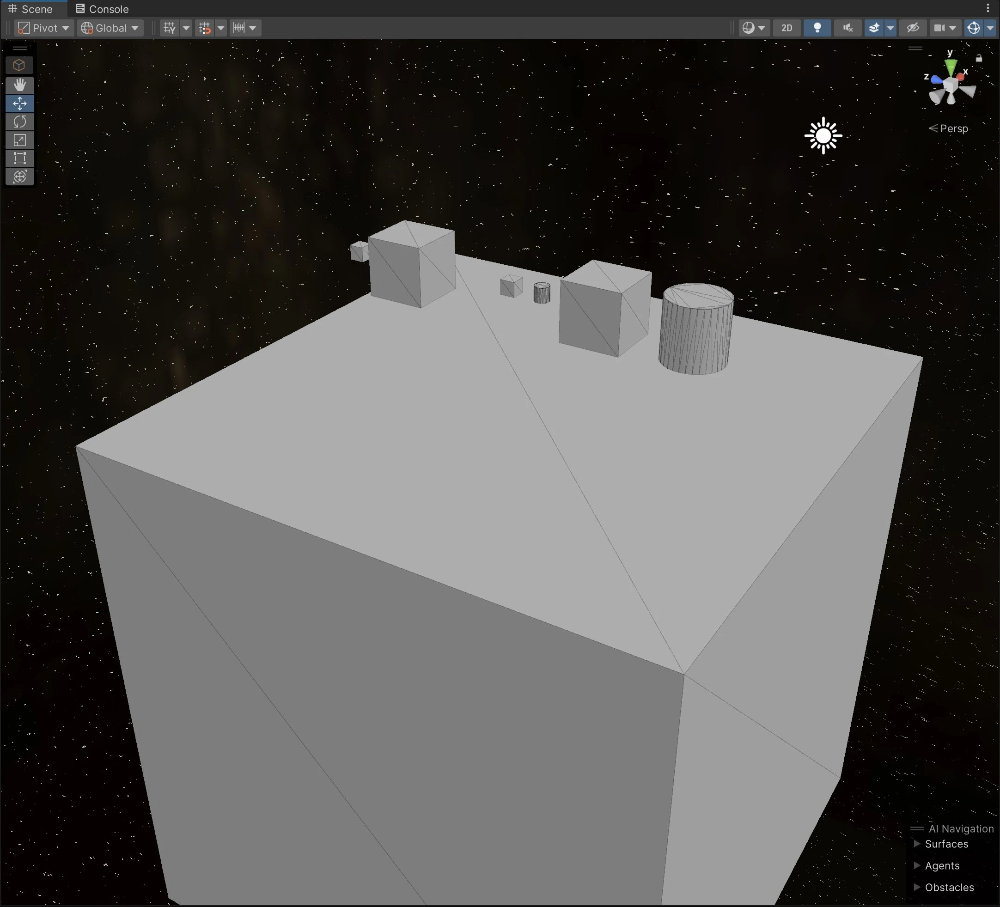</td>
    <td align="center">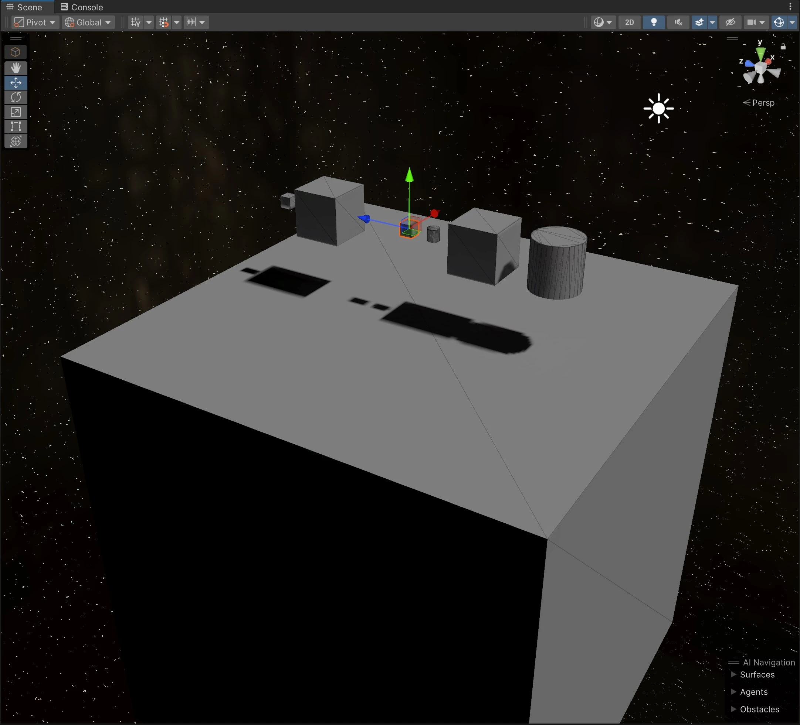</td>
  </tr>
</table>

<table width="100%">
  <tr>
    <th width="20%" align="center">Before Correction</th>
    <th width="20%" align="center">0.2</th>
    <th width="20%" align="center">0.5</th>
    <th width="20%" align="center">0.7</th>
    <th width="20%" align="center">1.0</th>
  </tr>
  <tr>
    <td align="center">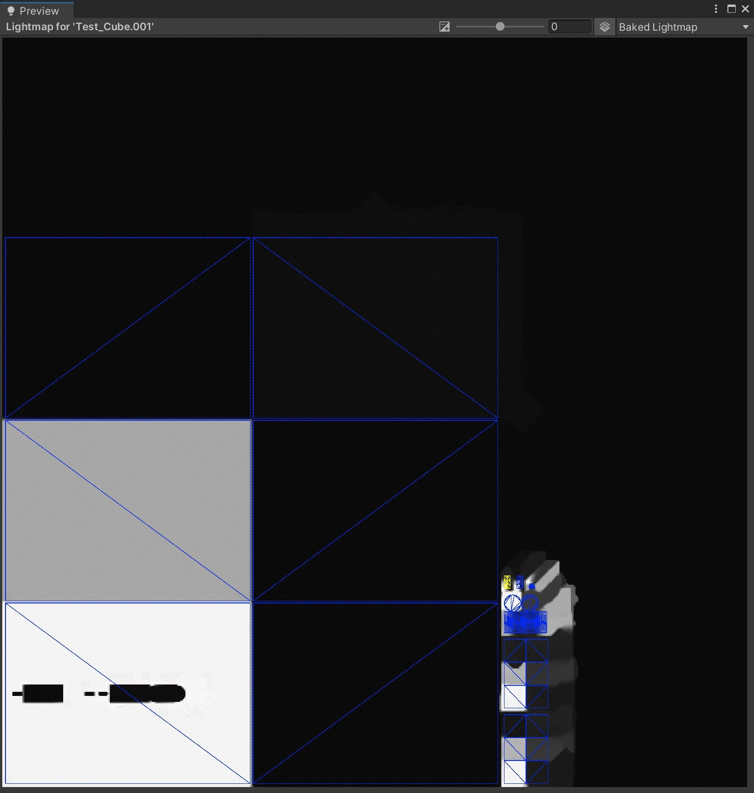</td>
    <td align="center">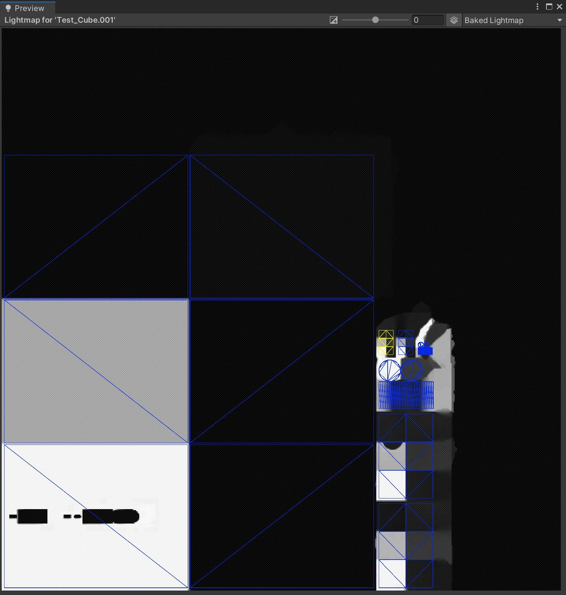</td>
    <td align="center">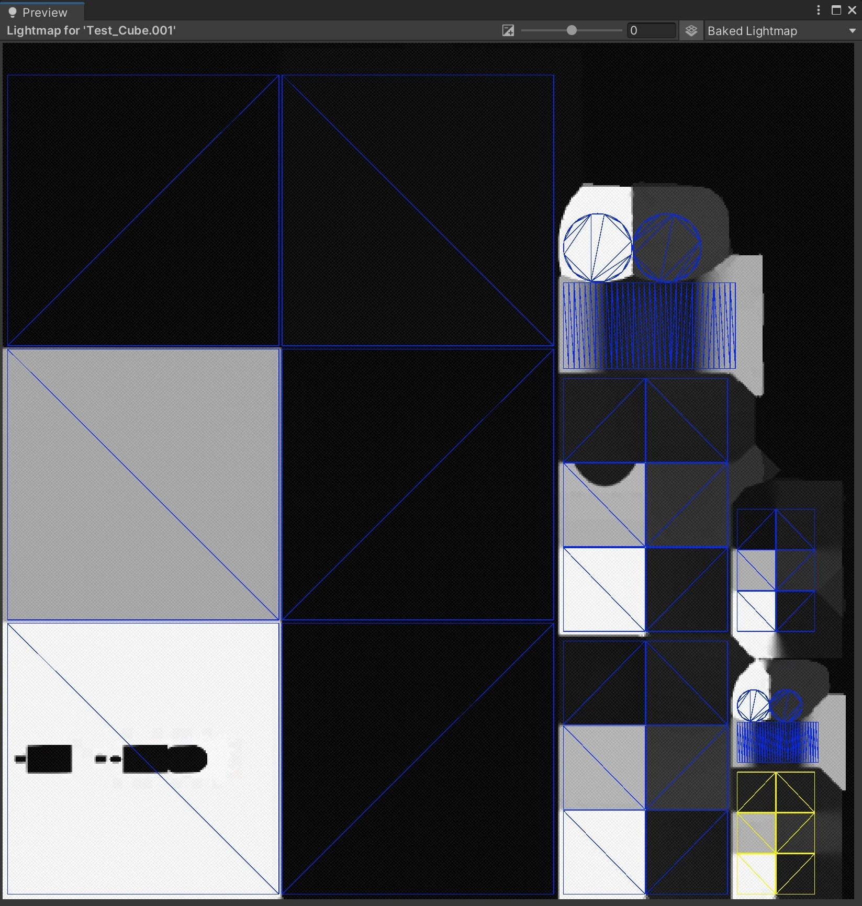</td>
    <td align="center">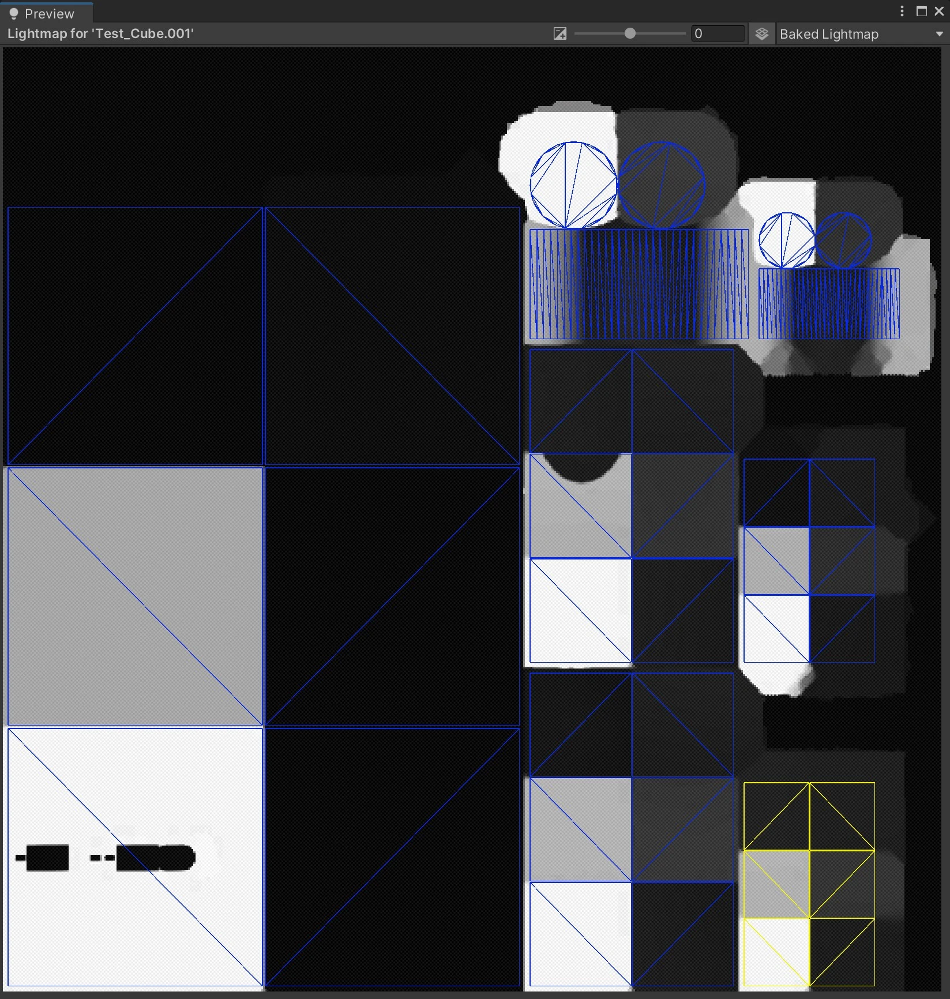</td>
    <td align="center">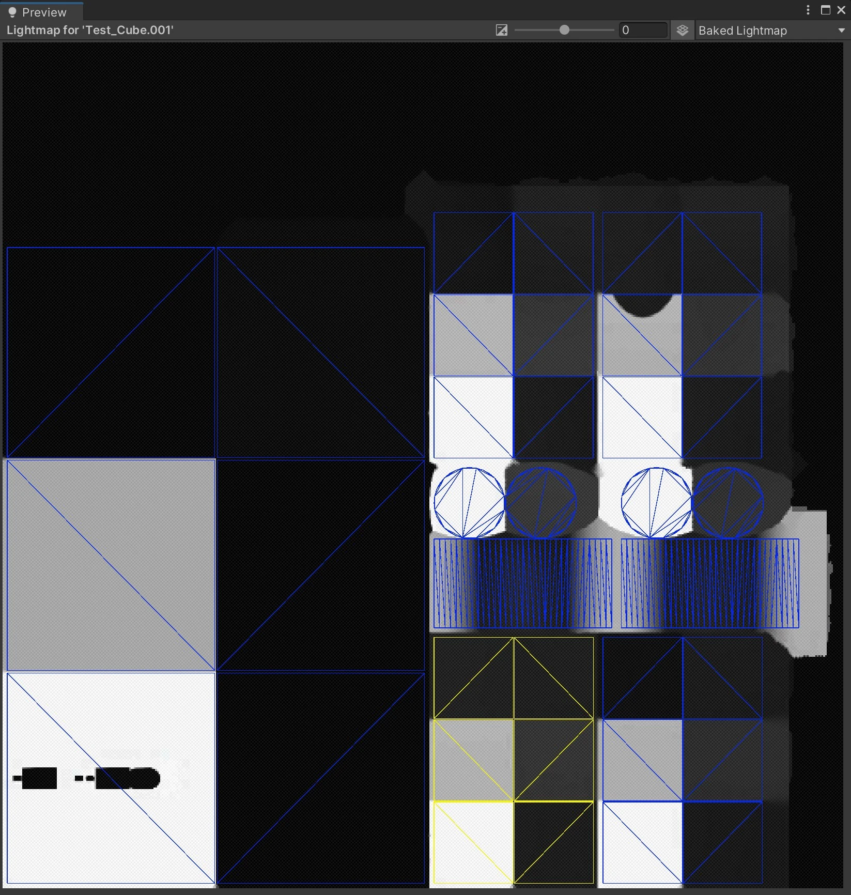</td>
  </tr>
  <tr>
    <td align="center">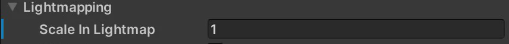</td>
    <td align="center"></td>
    <td align="center"></td>
    <td align="center">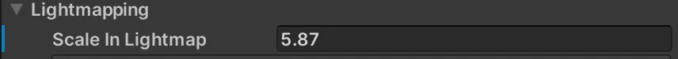</td>
    <td align="center">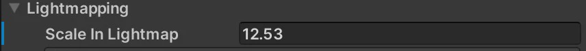</td>
  </tr>
</table>

---

## Frequently Asked Questions (FAQ)

**Q. If I run it by mistake, can I undo it?**  
A. Yes, all operations support Unity's standard `Undo` system. You can easily revert to the previous state using `Ctrl+Z`.

**Q. Will it overwrite values for objects I manually fine-tuned?**  
A. By changing the "Overwrite Mode" to "Only expand if too small" or "Smart Overwrite", you can protect your intentionally set extreme manual values while correcting the parts that need adjustment.

**Q. Are inactive objects included in the correction target?**  
A. They are excluded by default, but by unchecking the "Exclude Inactive Objects" option, you can include disabled objects in the calculation target.
