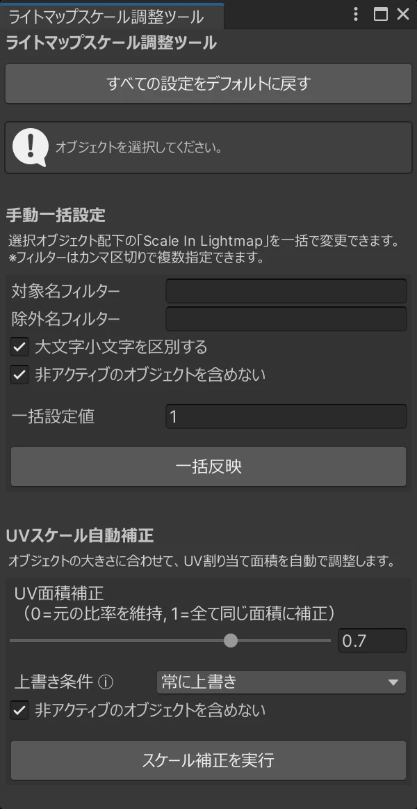
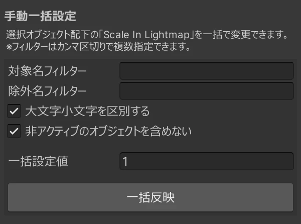
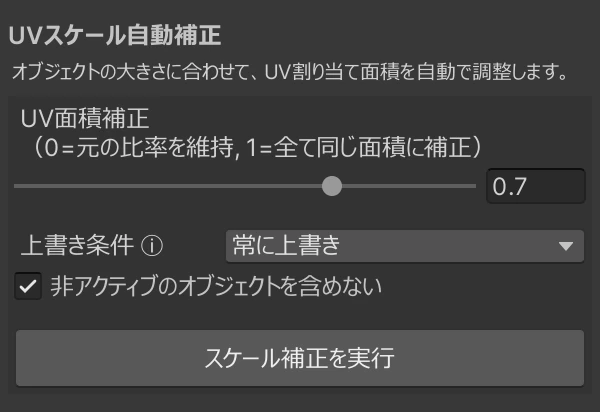

# Unity ライトマップスケール調整ツール

Unityエディタ上で、複数オブジェクトの `Scale In Lightmap` 値を効率的に一括設定・自動補正するためのエディタ拡張ツールです。特にBakery等のライトマッパーを使用して、大規模な背景シーンを構築する際に威力を発揮します。

> **⚠️ 注意: 自動補正機能を使用するには、対象オブジェクト（またはその親階層）にBakeryの `BakeryLightmapGroupSelector` コンポーネントがアタッチされている必要があります。**

## 最新の更新 (v1.0.0)

- **v1.0.0**: 初回リリース！手動の一括設定機能と、メッシュ表面積に基づいた自動補正機能を実装しました。

## 概要

大規模な背景シーンのライトマップベイクにおいて、オブジェクトごとのライトマップ解像度（密度）を手作業で調整するのは非常に手間がかかります。本ツールは以下の2つのアプローチでこの作業を効率化します。

1. **手動一括設定**: フィルター機能を使って、特定の名前を持つオブジェクト群の `Scale In Lightmap` を一気に変更します。
2. **UVスケール自動補正**: 実際の3Dメッシュの「表面積」を計算し、大きさの異なるオブジェクト同士のライトマップ密度が均一になるよう自動で計算・適用します。（※対象オブジェクト、またはその親階層にBakeryの `BakeryLightmapGroupSelector` が設定されている必要があります）

---

## インストール方法

1. GitHubのReleasesページから、最新のリリース用ZIPファイル（例: `LightmapScalerTool_JP_v1.0.0.zip`）をダウンロードして解凍します。
2. 中に入っている `LightmapScalerTool_JP.cs` を、Unityプロジェクト内の **`Editor` という名前のフォルダ内**に配置します。（例：`Assets/Editor/Tools/`）
3. コンパイルが完了すると、Unity上部のメニューに **`Tools > ライトマップスケール調整ツール`** が追加され、使用可能になります。

※ 英語版をご希望の場合は、`LightmapScalerTool_EN_vX.X.X.zip` をダウンロードしてください。機能は完全に同一です。

---

## 使い方

ツールウィンドウを開くと、大きく分けて2つの機能セクションがあります。

### 1. 手動一括設定（特定パーツをまとめて調整したい時）

選択したオブジェクトとその子階層にあるすべての `MeshRenderer` に対して、任意のスケール値を一括で適用します。

- **操作手順**:
  1. Hierarchyで対象の親オブジェクトを選択（複数可）。
  2. 必要に応じて「対象名フィルター」や「除外名フィルター」を入力（カンマ区切りで複数指定可能。例: `Wall,Floor`）。
  3. 「一括設定値」を入力し、「一括反映」ボタンをクリック。

### 2. UVスケール自動補正（オブジェクトの面積に合わせて自然に調整したい時）

> **⚠️ 必須条件**: この機能は Bakery アセットに依存しています。比較対象となる各オブジェクト（またはその親階層）に `BakeryLightmapGroupSelector` がアタッチされており、同じLightmap Groupが割り当てられている必要があります。

同じライトマップグループに属するオブジェクト間で、それぞれの「3D上の表面積」を比較し、自動的に最適な `Scale In Lightmap` 値を割り当てます。

- **スケール補正値（0.01〜1.0）**:
  補正の強さを調整します。値が1.0に近いほど面積のばらつきを均等化します。

<table width="100%">
  <tr>
    <th width="33%" align="center">補正なし</th>
    <th width="33%" align="center">0.5</th>
    <th width="33%" align="center">0.7</th>
  </tr>
  <tr>
    <td align="center"></td>
    <td align="center"></td>
    <td align="center"></td>
  </tr>
</table>

- **操作手順**:
  1. 補正したいLightmap Groupに属するMeshRendererを**1つだけ**選択します。
  2. 「UV面積補正（ガンマ値）」や「上書き条件」を設定します。
  3. 「スケール補正を実行」ボタンをクリックします。

---

## 自動補正機能の技術的な詳細（Tips）

この自動補正は単純なスケール合わせではなく、「面積の中央値」を基準にしたガンマ補正を用いています。

1. 対象グループ内の全メッシュの表面積を計算し、その**中央値（Median）**を基準面積とします。
2. 各オブジェクトの面積を基準面積で割り、「相対面積比」を求めます。
3. 指定された**UV面積補正（ガンマ値）**を用いて、最終的な目標スケールを計算します。
   `targetScale = pow(1 / relativeRatio, gammaValue)`

※同一形状でスケールのみが異なるオブジェクトを用意して検証した例です。左側がベイク前の配置（検証環境）、右側がベイク後（ライトマップの適用結果）を示しています。この環境において、ガンマ値を変更するとライトマップの割り当て面積がどのように変化するかを以下にまとめました。

<table width="40%">
  <tr>
    <th align="center">ベイク前</th>
    <th align="center">ベイク後</th>
  </tr>
  <tr>
    <td align="center"></td>
    <td align="center"></td>
  </tr>
</table>

<table width="100%">
  <tr>
    <th width="20%" align="center">補正前</th>
    <th width="20%" align="center">0.2</th>
    <th width="20%" align="center">0.5</th>
    <th width="20%" align="center">0.7</th>
    <th width="20%" align="center">1.0</th>
  </tr>
  <tr>
    <td align="center"></td>
    <td align="center"></td>
    <td align="center"></td>
    <td align="center"></td>
    <td align="center"></td>
  </tr>
  <tr>
    <td align="center"></td>
    <td align="center"></td>
    <td align="center"></td>
    <td align="center"></td>
    <td align="center"></td>
  </tr>
</table>

---

## よくある質問 (FAQ)

**Q. 間違えて実行してしまった場合、元に戻せますか？**  
A. はい、すべての操作はUnity標準の `Undo` に対応しています。`Ctrl+Z` で簡単に元の状態に戻すことができます。

**Q. 手動で細かく設定したオブジェクトの値まで上書きされてしまいますか？**  
A. 自動補正の「上書き条件」を「小さすぎるものだけ上書き（拡大）」や「必要な場合のみ上書き」に変更することで、手動で設定した意図的な数値を保護しつつ、足りていない部分だけを底上げすることが可能です。

**Q. 非アクティブなオブジェクトも補正対象に含まれますか？**  
A. デフォルトでは除外されますが、「非アクティブのオブジェクトを含めない」のチェックを外すことで、無効化されているオブジェクトも計算対象に含めることができます。
